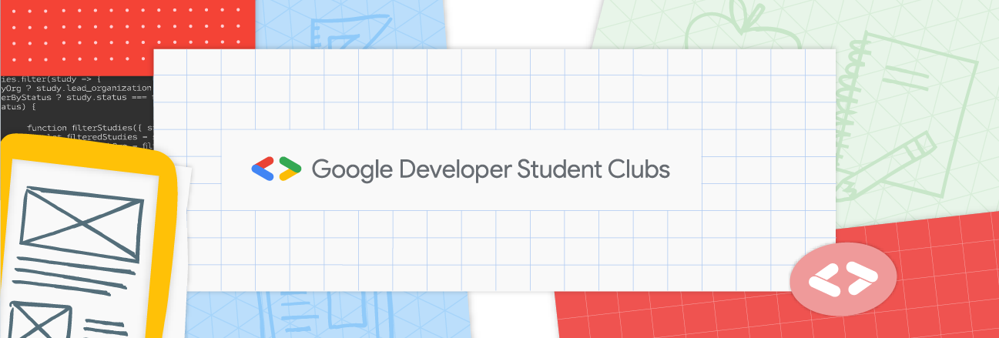

## Namaste 🙏
                            

  

                         
### Step into the exciting realm of GDSC SJEC as you embark on a journey through our official GitHub profile!🌐💡
We're a vibrant and diverse group dedicated to staying on the cutting edge of technology, crafting groundbreaking solutions through the magic of collaboration and teamwork.

  

### Curious about what we do? Wonder No More! 👨‍💻
Explore a dynamic array of thrilling events and activities with us, ranging from immersive workshops to stimulating coding challenges. Embracing our passion for coding, we constantly venture into uncharted territories of languages, frameworks, and tools, eagerly sharing our expertise and knowledge. Whether you're diving into development, contributing to ongoing projects, or simply indulging in some code tinkering, we're avid enthusiasts always ready to embrace a new challenge. 🤓🚀

### Join us today 🤝
Join our wonderful community on Discord 🤗 
[Discord link] [MAYBE ADD ICONS OF DISCORD AND GDSC]
Don't forget to join the GDSC SJEC chapter too!
[GDSC chapter link]
